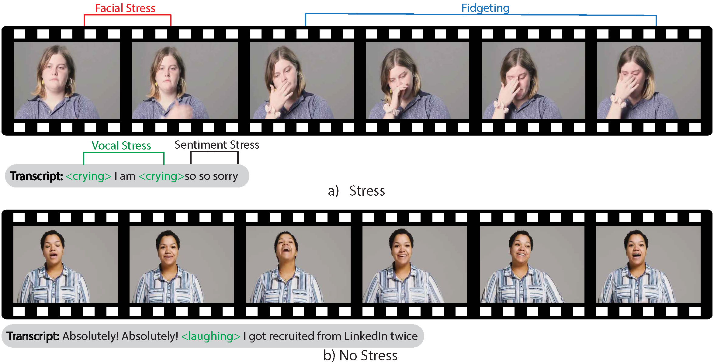
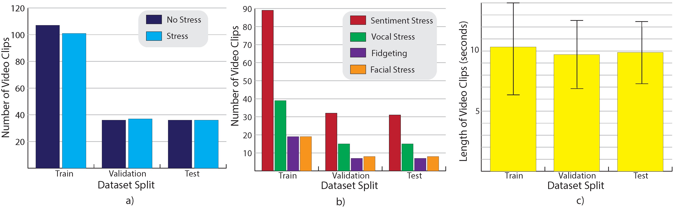
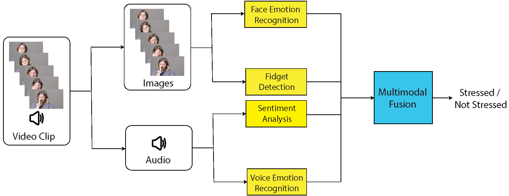
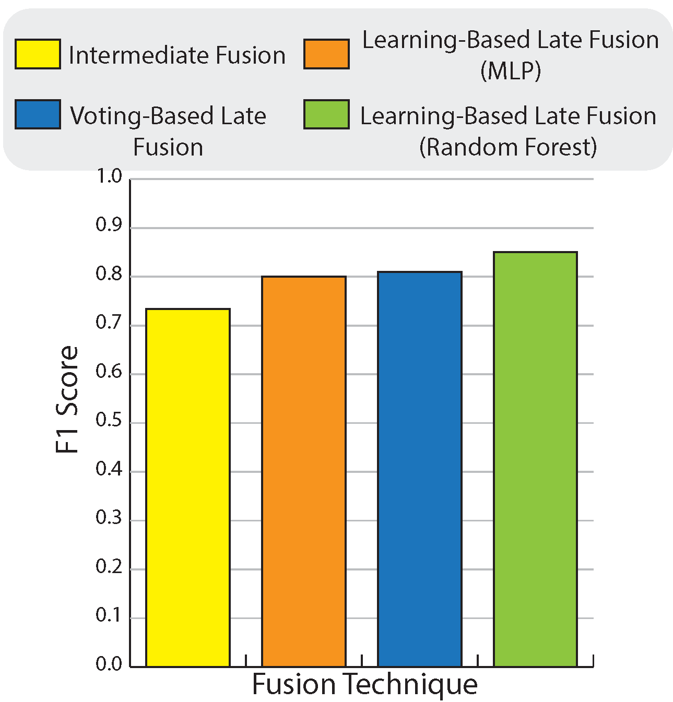

# MAS Dataset and Official Code for Integrating Multimodal Affective Signals for Stress Detection from Audio-Visual Data

*Debasmita Ghose, Oz Gitelson, Brian Scassellati*

*Yale University*

**International Conference on Multimodal Interaction, 2024 (ICMI, 2024)**

[Paper](https://dl.acm.org/doi/10.1145/3678957.3685717) | [Project Page](https://sites.google.com/view/stress-detection-icmi-24/home)

## Abstract
Stress detection in real-world settings presents significant challenges due to the complexity of human emotional expression influenced by biological, psychological, and social factors. While traditional methods like EEG, ECG, and EDA sensors provide direct measures of physiological responses, they are unsuitable for everyday environments due to their intrusive nature. Therefore, using non-contact, commonly available sensors like cameras and microphones to detect stress would be helpful. In this work, we use stress indicators from four key affective modalities extracted from audio-visual data: facial expressions, vocal prosody, textual sentiment, and physical fidgeting. To achieve this, we first labeled 353 video clips featuring individuals in monologue scenarios discussing personal experiences, indicating whether or not the individual is stressed based on our four modalities. Then, to effectively integrate signals from the four modalities, we extract stress signals from our audio-visual data using unimodal classifiers. Finally, to explore how the different modalities would interact to predict if a person is stressed, we compare the performance of three multimodal fusion methods: intermediate fusion, voting-based late fusion, and learning-based late fusion. Results indicate that combining multiple modes of information can effectively leverage the strengths of different modalities and achieve an F1 score of 0.85 for binary stress detection. Moreover, an ablation study shows that the more modalities are integrated, the higher the F1 score for detecting stress across all fusion techniques, demonstrating that our selected modalities possess complementary stress indicators.



# MAS Dataset

In this work, we curated a collection of 353 video clips. These
clips were sourced from two YouTube channels - "Keep it 100"
playlists created by the channel [The Cut](https://www.youtube.com/@cut) and videos from [Soft White Underbelly](https://www.youtube.com/@SoftWhiteUnderbelly) (SWU) . We selected these channels because
they feature monologues of people recalling their stressful life
experiences against a neutral background in a well-lit room while
sitting on an interview stool, as seen in Fig. 1. We chose to use
processed videos with proper lighting and simple backgrounds to
minimize environmental factors that could interfere with stress
detection models. Also, the use of stable cameras for our dataset
helps maintain a consistent framing and focus on the subjects. Each
video on the SWU channel features an interview with one person
for the entire duration, while each video on the Cut channel features
interviews with 100 people, one person at a time. We extracted clips
from 12 videos (containing 112 clips) from The Cut and 121 videos
(containing 241 clips) from SWU. In each video, only the upper body
of a person is visible. Then, we used a two-step data annotation
process:

### (1) Clip Selection: 
Two researchers with a background in Computer
Science selected videos from two YouTube channels in reverse
chronological order of publication. Then, for each video selected
from the two channels, short video clips were selected using the Label Studio video annotation tool. For the SWU channel, a video
was deemed useful if it showed at least one instance with no stress
signs and another that displayed one or more of the following stress
indicators: facial stress, sentiment stress, vocal stress, or fidgeting.
Facial stress was recognized when a person appeared angry, scared
or was seen crying. If a person talked about a sad or frustrating incident or seemed angry, the clip was labeled as containing sentiment
stress. Vocal stress was identified if a person’s voice was shaking or
heavy during a conversation. If a person displayed self-comforting
gestures like touching their face repeatedly, the clip was considered to contain fidgeting. Since The Cut channel’s videos consisted
of interviews with 100 people in a single video, the researchers
only included each person’s video clip once in the entire dataset
if it contained any of the above indicators of stress. We selected
videos that showed clear differences in individuals’ presentations
or discussions under stressful and non-stressful conditions. Videos
without discernible variations in expressions, tone, or behavior during stressful versus non-stressful situations were eliminated. The
duration of the video clips ranged between 2.9 and 25.5 seconds,
with an average of 9.8 ± 3.5 seconds. Since one of our modalities
for stress detection is the contents of a person’s speech, it was
important to include their complete statements without truncating
their sentences to limit our dataset to videos of fixed lengths.

### (2) Stress Indicator Annotation: 
After the clips were selected, the
same two researchers used the Label Studio tool to annotate
each video clip with one or more indicators of stress (sentiment
stress, vocal stress, fidgeting or facial stress) or no stress. Each
video clip was annotated with either stress or no stress labels as
shown in Fig. 1. If a video was annotated with the label stress, it
was additionally annotated with one of the four stress indicators.
The Inter-Rater Reliability (IRR) score calculated using Cohen’s
Kappa method for labeling speech sentiment stress was 0.85, facial
stress was 0.7, fidgeting was 0.56, and vocal prosodic stress was
0.42 between the two researchers. Overall, the IRR for stressed or
non-stressed states was 0.85 indicating an excellent agreement.



## Downloading the Dataset


### Pre-Requisites
- python3
- pytube
- moviepy

### Running the Script
From the `MAS_dataset` directory, run the following command:
```
python3 dataset/create_dataset.py
```
This will download all clips from Youtube.

# Stress Detector

we show how we predict stress indicators by leveraging insights from multiple modalities, as shown in Figure 3. Specifically, we analyze a short video clip of a person speaking about a
topic on camera and determine if the person is stressed by examining the following four factors: 1) their facial expressions, 2) the
prosodic intonation in their voice, 3) the sentiment conveyed in
the content of their speech, and 4) any upper body fidgeting. To
achieve this, we extract stress signals from each of these modalities using unimodal classifiers and then employ three methods for
fusing the predictions of the unimodal classifiers to make a final
binary prediction about whether the person is stressed.



## Running and Integrating Unimodal Nodes

Each node can be run independently with command line arguments, or used as part of a larger python program. Here's how to run each node:

### Running the Audio Node

The Audio Node performs audio sentiment analysis (sadness, anger, fear, joy, love, surprise), including speech-to-text (STT) and emotion detection.

**Input:** Video file path.

**Output:** Average emotion scores, speech rate, and transcript.

The following bash command runs the audio node:

```
python audio.py <path_to_audio_or_video_file>
```

The following python code creates an audio node and processes a file with it:

```python
from audio import AudioNode

node = AudioNode()
emotions, speech_rate, transcript = node.analyze(path)
```


### Running the Face Node

The Face Node detects and analyzes facial emotions (anger, disgust, fear, sadness, neutral, happiness, surprise) in video frames.

**Input:** Video file path.

**Output:** Average emotion scores and the percentage of frames without detected faces.

The following bash command runs the face node:

```
python face.py <path_to_video_file>
```

The following python code creates a face node and processes a file with it:

```python
from face import FaceNode

node = FaceNode()
emotions, off_screen_percent = node.analyze(path)
```


### Running the Prosodic Node

The Prosodic Node analyzes prosodic features of speech to classify emotions (sad, angry, neutral, happy).

**Input:** Video file path.

**Output:** Average emotion scores

The following bash command runs the prosody node:

```
python prosodic.py <path_to_audio_or_video_file>
```

The following python code creates a prosodic node and processes a file with it:

```python
from prosodic import ProsodicNode

node = ProsodicNode()
emotions = node.analyze(path)
```


### Running the Fidget Node

The Fidget Node detects fidgeting behavior in video frames using the MoveNet pose estimation model.

**Input:** Video file path.

**Output:** Percentage of frames with detected fidgeting.

The following bash command runs the fidget node:

```
python fidget.py <path_to_video_file>
```

The following python code creates a fidget node and processes a file with it:

```python
from fidget import FidgetNode

node = FidgetNode()
fidget_percent = node.analyze(path)
```

## Running and Integrating Fusion Nodes
### Voting-Based Fusion

The Voting Fusion Node utilizes Voting-Based Late Fusion to detect whether a video subject is exhibiting audiovisual stress. It can be configured to use any combination of the unimodal nodes. 

For more information on running the Voting Fusion Node from the command line, please see
```commandline
python3 voting_fusion.py -h
```

The follow python code creates a voting fusion node, all the unimodal nodes it needs, and makes a prediction using them:
```python
face, fidget, audio, prosodic = FaceNode(), FidgetNode(), AudioNode(), ProsodicNode()

fusion_node=VotingFusionNode(audio, face, fidget, prosodic)
path='path/to/data.mp4'
prediction, unimodal_data= fusion_node.make_prediction(path)
```


# Citation
```
@inproceedings{ghose2024integrating,
  title={Integrating Multimodal Affective Signals for Stress Detection from Audio-Visual Data},
  author={Ghose, Debasmita and Gitelson, Oz and Scassellati, Brian},
  booktitle={Proceedings of the 26th International Conference on Multimodal Interaction},
  pages={22--32},
  year={2024}
}
```

